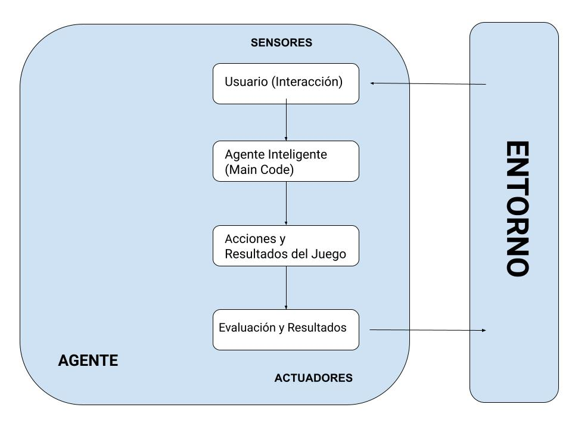

# Piedra-papel-tijeras-lagarto-spock
Práctica del curso de especialización de IA y Big Data - IES de Teis (Bruno Álvarez Darriba)

# Entorno de tareas
Entorno de tareas | Observable| Axentes | Determinista | Episódico | Estático | Discreto 
| :---: | :---: | :---: | :---: | :---: | :---: | :---: |
 RPS | Parcialmente observable | Multiagente | Determinista | Episódico | Estático | Discreto

 - **Parcialmente observable**: debido a que a la hora de llevar a cabo la acción, no contamos con la visión total del entorno del juego. Es decir, no contamos con información acerca del adversario hasta que no realiza su acción de sacar una de las 3 posibilidades.

- **Multiagente**: para llegar al objetivo del juego, el cuál es ganar, es necesario jugar contra alguien.

- **Determinista**: conocemos las opciones que pueden realizar los jugadores (piedra, papel y tijera), sin existir ningún elemento aleatorio que permita la creación de una nueva opción.

- **Episódico**: centrándonos en que el entorno es cada una de las partidas, única y exclusivamente cada partida, las acciones realizadas hasta cumplir el objetivo del juego no dependen en nada para la siguiente partida.

- **Estático**: mientras que los jugadores deliberan las acciones que van realizar, no cambia el entorno.

- **Discreto**: hay número finito de posibilidades a realizar.

# Estructura del agente

**1. Interacción del Usuario:**

Esta fase inicia cuando el programa solicita al usuario el número de juegos que desea jugar.
- El usuario ingresa la cantidad de juegos que quiere jugar.
- Durante el juego, el usuario interactúa proporcionando su elección en cada ronda.

**2. Agente Inteligente (Main Code):**

El código principal del agente inteligente controla el flujo del juego.
Incluye funciones para obtener la acción del usuario, obtener la acción de la computadora, evaluar el resultado del juego y contar las victorias totales del usuario.

**3. Acciones y Resultados del Juego:**

- Representa las acciones disponibles (piedra, papel o tijeras) y los resultados posibles del juego (victoria, derrota o empate).
- Define las reglas para determinar quién gana en función de las elecciones del usuario y la computadora.

**4. Evaluación y Resultados:**

En esta fase, se evalúa el resultado de cada ronda.
- Se comparan las elecciones del usuario y la computadora para determinar quién gana según las reglas del juego.
- Se muestran los resultados de cada ronda al usuario y se lleva un registro de las victorias totales del usuario.

# Implementación - Simulando IA
Lo primero de todo fue añadir que el programa solicitase un número de partidas que se van a jugar. Después de eso, declaro un diccionario vacío en el que voy a ir guardando la opción que escoge el usuario y las veces que la escoge. 
La estrategia a seguir es la siguiente: en la primera partida que se juega el programa siempre va a sacar piedra (hacemos que escoja una opción estática ya que sino en la primera partida el usuario siempre perdía), en las demás partidas el algoritmo se basa en escoger la opción contraria a la que más usa el usuario (la miramos en el diccionario ya que lo guardamos anteriormente). 
Aparte de eso también llevamos la cuenta de las partidas ganadas respecto a las partidas jugadas para poder mirar el porcentaje de victoria del usuario.

La estrategia es la misma en el caso de la extensión, solo que a la hora de escoger la opción ganadora al movimiento del usuario, en este caso hay dos opciones que ganan a cualquier movimiento del usuario. Por ello para que no siempre escogiese la primera opción del vector que almacena que movimiento gana a otro, añadí que a la hora de dar la opción ganadora sea un random la que elija entre las dos opciones posibles.

# Bibliografía
- Inteligencia Artificial un enfoque moderno, 2da Ed (Stuart Russell y Peter Norvig)